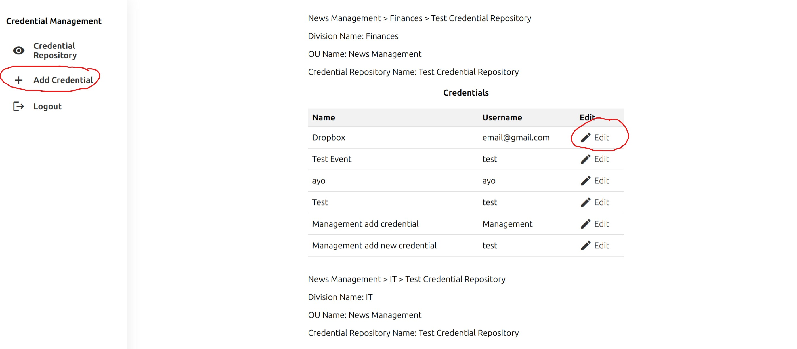
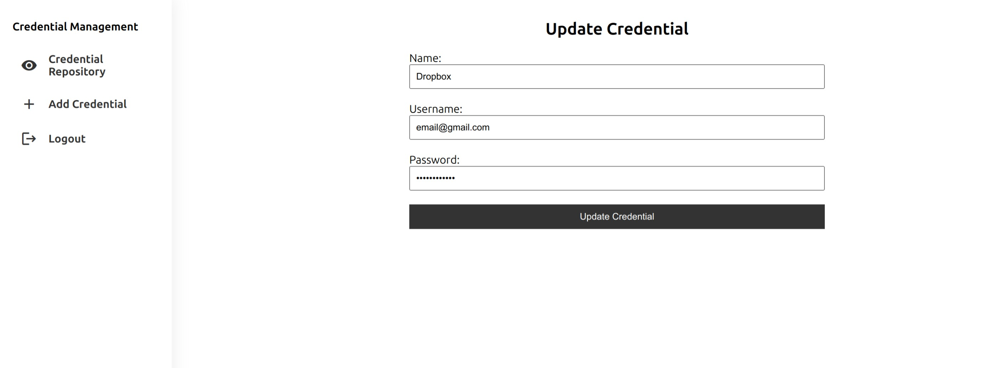

# Credential Management

This is an internal web application for managing credentials such as login details (username and password) for various resources.

# Features

- User registration and login with JWT authentication
- Different user roles: normal users, management users, and admin users
- Resource access control based on user roles and permissions
- Organizational units (OU) and divisions for organizing credentials
- Credential repositories for each division
- View, add, and update credentials in the repositories
- Assign and unassign users from divisions and OUs (admin only)
- Change user roles (admin only)

# Start the Server

1. Navigate to the backend directory: `cd project/backend`
2. Install the dependencies: `npm install`
3. Start the backend server: `npm start`

# Frontend Setup

1. Navigate to the frontend directory: `cd project/frontend`
2. Install the dependencies: `npm install`
3. Start the backend server: `npm start`

# Technologies Used

1. Frontend: React.js
2. Backend: Express.js
3. Database: MongoDB with Mongoose (ODM)
4. Authentication: JSON Web Tokens (JWT)

# Management functionality: Add/edit credential

The management functionality allows users with management roles to add or edit credentials. The process involves listing the credentials in a table and providing an edit button to update the credential details.

1. Listing Credentials:
   When accessing the credential management section, the user is presented with a table that lists all the credentials. Each row in the table represents a credential entry and displays relevant information about the credential. To the left of each row, an edit button is available for making updates.
   

2. To edit a credential, the user can click the edit button corresponding to the credential they want to update. This action opens up a form specifically designed for modifying the credential details. The form allows the user to make changes to the credential's information, such as the username, password.

  
